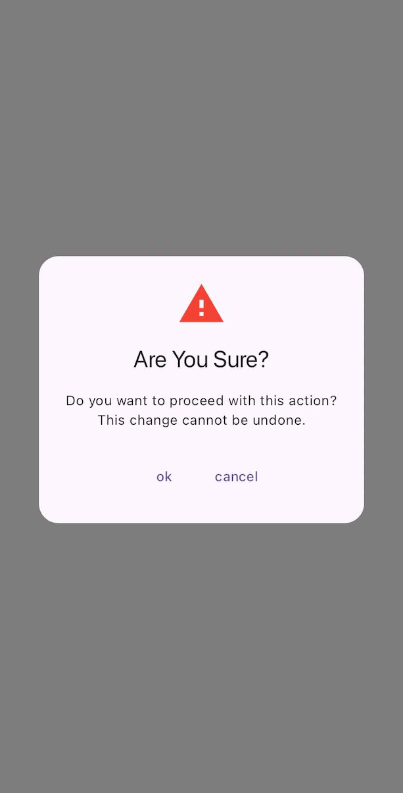

# Webkul Alert Box Flutter Package

The `WebkulAlertBox` is a customizable Flutter widget that allows you to show alert dialogs with various animation styles or without animation. This package provides a flexible and easy-to-use way to display alerts with custom titles, messages, icons, and actions.

To find out more, visit: [https://mobikul.com/](https://mobikul.com/)

## Features

- Display alert dialogs with or without animations.
- Customizable alert dialog with title, message, icon, and actions.
- Various animation styles including sliding from different directions.
- Optional duration and dismissible behavior for the alert box.

## Installation

To use the package in your Flutter project, add the following dependency in your `pubspec.yaml` file:
```.yaml
dependencies:
  flutter:
    sdk: flutter
  flutter_webkul_alert_box: ^0.0.6  # Replace with the latest version
```

## Usages
# Import the package:
```dart
import 'package:webkul_alert_box/flutter_webkul_alert_box.dart';
```
## Properties

| Property               | Type                 | Default                | Description                                                                                  |
|------------------------|----------------------|------------------------|----------------------------------------------------------------------------------------------|
| `context`              | `BuildContext`      | `Required`             | The current `BuildContext`, required to display the alert box.                               |
| `animation`            | `AnimationType`     | `AnimationType.none`   | The animation style used for displaying the alert box. Options include `none`, `dropFromTop`, `dropFromBottom`, `slideFromRight`, `slideFromLeft`, and more. |
| `title`                | `String?`           | `""`                 | The title text displayed in the alert box.                                                  |
| `icon`                 | `Widget?`           | `""`                 | An optional icon displayed at the top of the alert box.                                      |
| `content`              | `String?`           | `""`                 | The message or content displayed in the alert box.                                           |
| `actions`              | `List<Widget>`      | `const <Widget>[]`     | A list of action widgets (e.g., buttons) displayed at the bottom of the alert box.           |
| `animationDuration`    | `double`            | `300`                  | The duration of the animation in milliseconds.                                              |
| `barrierDismissible`   | `bool`              | `true`                 | Whether the alert box can be dismissed by tapping outside its boundaries.                   |

# Show an Alert Box with no animation:
```dart
MobikulAlertBox(
  context,
  title: "Test Title",
  content: "This is a test message.",
  animation: AnimationType.none,
  animationDuration: 300,
  barrierDismissible: true,
  icon: Icon(Icons.info),
  actions: [
    TextButton(
      onPressed: () {
        Navigator.of(context).pop();
      },
      child: Text("OK")
    )
  ]
);

```

# Show an Alert Box with a specific animation:
```dart
MobikulAlertBox(
  context,
  title: "Animated Alert",
  content: "This alert will appear with an animation.",
  animation: AnimationType.slideFromTopLeft,
  animationDuration: 500,
  barrierDismissible: false,
  icon: Icon(Icons.warning),
  actions: [
    TextButton(
      onPressed: () {
        Navigator.of(context).pop();
      },
      child: Text("Dismiss")
    )
  ]
);

```

## Output

Here is a screenshot of the Webkul Alert Box in action:




